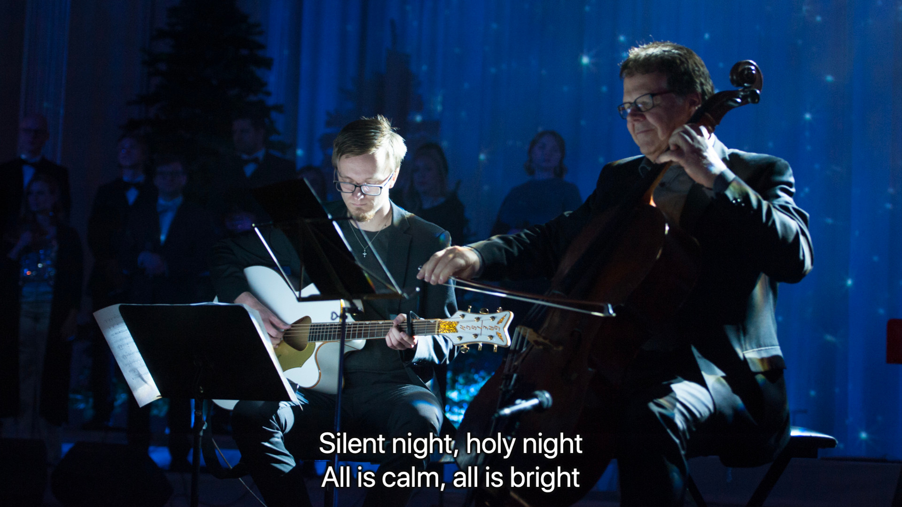

Stage Display Viewer
==================

Stage display viewer in java for Propresenter 6 and 5.

The output text is shown in a lower key fashion, i.e. it's shown in the lower part of the screen. It also compactifies rows by removing every second line break, i.e. 4 rows will be shown as 2 rows.

It should work in Windows/MacOS/Linux and other *nix systems

# Example usage
Here is an example of how a slide in propresenter can be transformed into a lower key.
Here the secondary language is removed and the text is placed at the bottom of the screen.
A small shadow is added to make text easier to read. This is accomplished using stage display viewer and OBS.

# Usage
Propresenter must be running when running stage display viewer.

Either just double click the jar file or, if your OS is not configured for starting jar files, start program as following:

Windows:

    run.bat

MacOS/Linux/*nix

    ./run.sh

## Adding lower key on video with shadows
This can be achieved in OBS. Add stage display viewer window/screen as a source on top of video stream in OBS.
Then add a Color key filter to the stage display source with settings.

    Key Color Type: Custom
    Key Color: #111111 (#ff111111)
    Similarity: 1
    
This will give you an easy to read lower key with a discreet black shadow.
The key color must be the same as specified in styles.css and should preferably be quite dark but not completely black to give the best effect.

## Transform text
Text transform support: compactify rows by removing every second line break, i.e. 4 rows will be shown as 2 rows.
Property specified in file config.properties

    TEXT_TRANSLATOR_ACTIVE = true

## Capitalize lines
Capitalizes the first letter in every line.
Property specified in file config.properties

    CAPITALIZE_LINES = false

## Capitalize text
Capitalizes the text
Property specified in file config.properties

    CAPITALIZE_TEXT = true

## Preserve two lines
This setting will preserve two lines and not convert that into one line when text_translator_active is true

    PRESERVE_TWO_LINES = true  
   
## Custom New Line Insertion
Makes it possible to explicitly place each new line in the slide.
In a slide that should have custom new lines, add commands line this to the Stage Display Notes:

    NEWLINE x 
   
Where x is the position of the word the newline should be inserted after. You can insert multiple newlines by 
adding more numbers to the command separated by a space.
Example:

    NEWLINE 1 4

inserts newlines after the first and fourth word.

All whitespace other than what is specified in the NEWLINE command is removed.

Can be used on the same slide as a Midi command, just separate them with a space:

    NEWLINE 1 4 Midi 0 60 92

## Multi language support
Removes lines after an empty line
This is useful if multiple languages are shown separated with a line break and only the first language are to be shown

    REMOVE_LINES_AFTER_EMPTY_LINE = true
    
## Change margin below text
This setting sets the margin below the text

    MARGIN_BOTTOM = 30

## Midi module
Midi module makes it possible to send midi commands from propresenter.

Activate midi module in properties file config.properties

    MIDI = true
    
In propresenter on a slide that should send a midi command should add commands like this to Stage Display Notes:

    Midi 0 60 92

Where

    Midi channel note velocity

The 0 indicates the channel, 60 indicates the note Middle C and the 92 is an arbitrary key-down velocity value

# [Releases](https://github.com/danielkihlgren/stagedisplayviewer/releases)

v1.7.0
Fix Issue #24: Add option to transform text to Uppercase
Fix Issue #25: Fix problem where styles.css not found when path contains whitespaces

[v1.6.0](https://github.com/danielkihlgren/stagedisplayviewer/releases/tag/v1.6.0) [download](https://github.com/danielkihlgren/stagedisplayviewer/releases/download/v1.6.0/StageDisplayViewer-v1.6.0.zip)
Fix Issue #15: Enhancements Request
Fix Issue #17: Enhancements Request
Fix Issue #18: Fix fading issues when font size changes
Fix Issue #19: Add window mode support

[v1.5.0](https://github.com/danielkihlgren/stagedisplayviewer/releases/tag/v1.5.0) [download](https://github.com/danielkihlgren/stagedisplayviewer/releases/download/v1.5.0/StageDisplayViewer.zip)
Make it more resilience by adding auto-reconnect

[v1.4.0](https://github.com/danielkihlgren/stagedisplayviewer/releases/tag/v1.4.0) [download](https://github.com/danielkihlgren/stagedisplayviewer/releases/download/v1.4.0/StageDisplayViewer.zip)
Add feature #9 to make it possible to change margin below text

[v1.3.0](https://github.com/danielkihlgren/stagedisplayviewer/releases/tag/v1.3.0) [download](https://github.com/danielkihlgren/stagedisplayviewer/releases/download/v1.3.0/StageDisplayViewer.zip)
Add feature #8 to make it possible to preserve two rows
Bug fixes #1, #4

[v1.2.0](https://github.com/danielkihlgren/stagedisplayviewer/releases/tag/v1.2.0) [download](https://github.com/danielkihlgren/stagedisplayviewer/releases/download/v1.2.0/StageDisplayViewer.zip)
Add support for propresenter 6 for windows

[v1.1.0](https://github.com/danielkihlgren/stagedisplayviewer/releases/tag/v1.1.0) [download](https://github.com/danielkihlgren/stagedisplayviewer/releases/download/v1.1.0/StageDisplayViewer.zip)
Add midi module support. This makes it possible to send midi command from propresenter.

[v1.0.0](https://github.com/danielkihlgren/stagedisplayviewer/releases/tag/v1.0.0) [download](https://github.com/danielkihlgren/stagedisplayviewer/releases/download/v1.0.0/StageDisplayViewer.zip)
First release.

# Known problems
* [Propresenter 7 not supported](https://github.com/danielkihlgren/stagedisplayviewer/issues/28)
* Propresenter 5 for Windows does not support UTF-8 correctly which makes international characters to be shown incorrectly, e.g. Swedish characters ÅÄÖ are shown as ???. This is fixed in propresenter 6.
